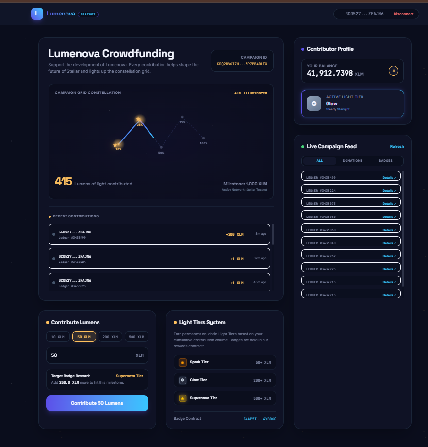
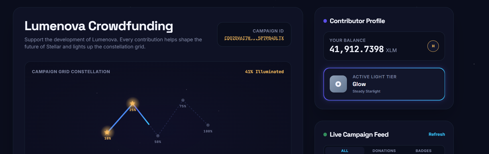
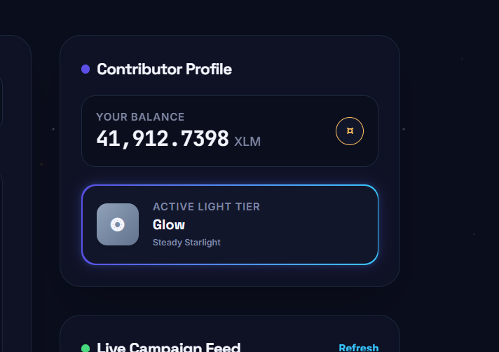
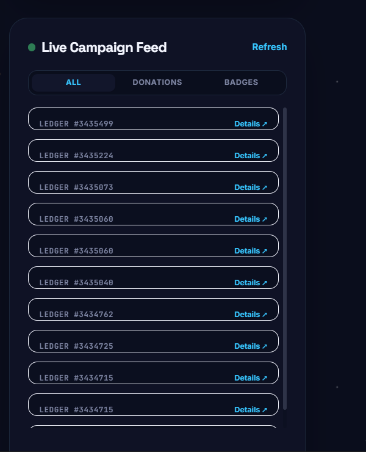
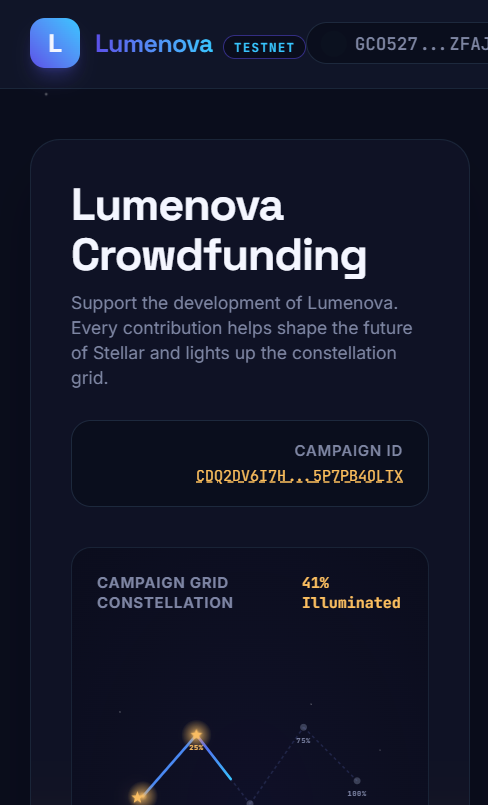
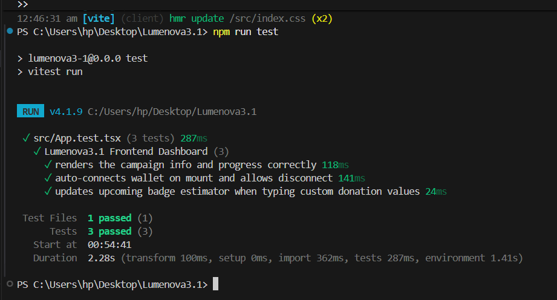
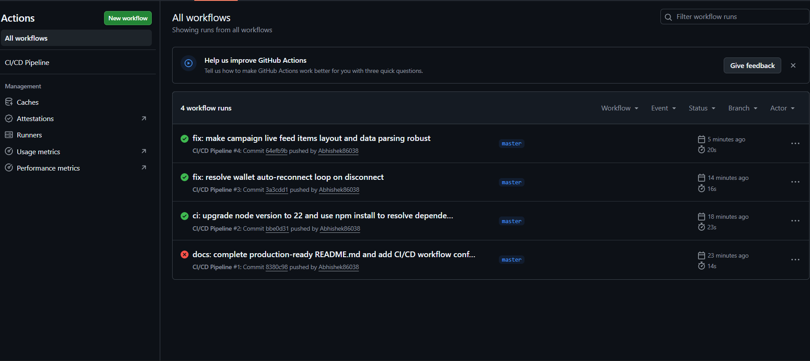

# 🌌 Lumenova-L3

### Trustless Crowdfunding and Milestone-Based Reward Badges on Stellar Soroban
*A production-ready decentralized crowdfunding suite built for Level 3 (Orange Belt) of the Stellar Builder Challenge.*

[](https://github.com/Abhishek86038/Lumenova3.1/actions)
[](https://opensource.org/licenses/MIT)

---

## 📸 Screenshots & Gallery

### 1. Main Dashboard

*Visual representation of campaign goals, progress, and interactive slider.*

### 2. Wallet Connection

*Freighter wallet integration connecting account and balance dynamically.*

### 3. Badge Upgrade Success

*Bronze, Silver, or Gold badge earned upon hitting contribution tiers.*

### 4. Live Event Feed

*Live event logs polled directly from Soroban RPC.*

### 5. Mobile Responsive View

*Responsive glassmorphic UI optimized for mobile viewports.*

### 6. Test Output

*Passing Vitest dashboard unit and integration test runs.*

### 7. CI/CD Pipeline

*Successful GitHub Actions workflow run.*

---

## 🔗 Project Links & Verification

- **Live Demo URL:** [Lumenova Web App | Live Demo](https://lumenova3-1.vercel.app/)
- **Demo Video Walkthrough:** [YouTube Video | Demo Walkthrough](https://youtu.be/lX7_2AUlwvg)
- **Stellar Expert Verification:**
  - Crowdfunding Contract: [Stellar.Expert | `CDQ2DV6I7HIZYOALI4RZ42MTWKAFUODQWP4BH2GHMKP37Z5P7PB4OLTX`](https://stellar.expert/explorer/testnet/contract/CDQ2DV6I7HIZYOALI4RZ42MTWKAFUODQWP4BH2GHMKP37Z5P7PB4OLTX)
  - Rewards Badge Contract: [Stellar.Expert | `CAAP5TGGZGLFXYGJY2H2O637FREG4EXE2PXI3A3Y4D6ST74QMI4YBD6C`](https://stellar.expert/explorer/testnet/contract/CAAP5TGGZGLFXYGJY2H2O637FREG4EXE2PXI3A3Y4D6ST74QMI4YBD6C)
  - Verification Tx Hash: [Stellar.Expert | `4545935f8bb64de8cc5f3ef7e9e8f4955b252069eaee7c2a71d4bf74534a7873`](https://stellar.expert/explorer/testnet/tx/4545935f8bb64de8cc5f3ef7e9e8f4955b252069eaee7c2a71d4bf74534a7873)

---

## 🔍 Overview

Lumenova-L3 is an advanced decentralized crowdfunding application built from scratch to showcase the power of the Stellar Soroban smart contract framework. Rather than acting as a simple utility, the application operates as an integrated ecosystem where backing a campaign immediately rewards supporters with persistent, upgradable on-chain badges that represent their status. This qualifies as a production-ready Level 3 (Orange Belt) submission by meeting the strict technical parameters of cross-contract invocation, real-time RPC event parsing, comprehensive unit/integration testing, standard linting, and modern glassmorphic design.

When a donor contributes XLM to the crowdfunding campaign, the funds are immediately disbursed to the campaign creator on-chain via the native XLM token contract. Simultaneously, the Crowdfunding contract executes an inter-contract invocation to the Rewards Badge contract to inspect the user's cumulative contribution history and determine if they qualify for a badge upgrade. If the threshold is met, the Badge contract mints or upgrades their badge to the corresponding tier (Bronze, Silver, or Gold) directly in contract storage.

To prevent dependency and build conflicts commonly associated with bundled Web3 wallet kits, Lumenova-L3 uses a clean integration of the raw `@stellar/freighter-api`. It fetches account details, queries balances via the Horizon server, and prompts user signatures in an isolated, secure manner. The frontend UI implements a double-refresh state sync pattern that refreshes data immediately upon transaction receipt and then polls again 2.5 seconds later, ensuring that RPC node indexing delays do not cause UI stutter.

---

## ⚙️ Architecture & Data Flow

The application executes cross-contract calls directly on-chain during donation:

```
[Donor (Freighter)]
       |
       |  1. Sign transaction (XDR)
       v
[Frontend App]
       |
       |  2. Submit transaction to Soroban RPC
       v
[Crowdfunding Contract] 
       |
       +-- 3. transfer(donor, campaign_owner, amount) -------> [Native XLM Contract]
       |
       +-- 4. get_badge_tier(donor) -------------------------> [Rewards Badge Contract]
       |      (Returns current tier: 0, 1, 2, or 3)
       |
       +-- 5. mint_badge(donor, new_tier) [If upgradeable] --> [Rewards Badge Contract]
       |      (Updates donor persistent storage)
       |
       v  6. Emit "donation_received" & "badge_minted" events
[Soroban Event Indexer]
       |
       |  7. Poll & Parse Events
       v
[Frontend Dashboard Feed]
```

### Prose Explanation:
1. **Initiation:** The donor inputs a donation amount in the frontend slider or input field. The frontend calls the Soroban RPC server to simulate resources, prepares the transaction, and prompts the user's Freighter extension to sign the transaction.
2. **Execution:** Once signed, the envelope is submitted to the Soroban Testnet RPC. The Crowdfunding contract’s `donate` function is called.
3. **Disbursement:** The Crowdfunding contract invokes the native token client to transfer the specified amount of stroops directly from the donor's balance to the campaign creator's address (immediate disbursement).
4. **Validation:** The Crowdfunding contract retrieves the donor's cumulative contributions from its persistent storage. It evaluates the new total against the reward badge thresholds.
5. **Cross-Contract Upgrade:** It invokes `get_badge_tier` on the Rewards Badge contract. If the new calculated tier exceeds their current tier, it invokes `mint_badge` on the Rewards Badge contract, which updates the donor's badge tier in persistent storage.
6. **Events & Sync:** Both contracts publish events (`donation_received` and `badge_minted`). The frontend reads the success status, performs an immediate refresh of the user's balance and campaign totals, and schedules a second sync 2.5 seconds later to catch the indexed event log in the live feed.

---

## ✨ Features

- **Freighter Wallet Connector:** Secure, popup-based user authorization via `requestAccess()`, with non-invasive address retrieval via `getAddress()` on page reload.
- **Milestone Reward Badges:** Permanent on-chain status tracking (Bronze, Silver, Gold) written directly to the contract storage.
- **Dynamic Slider Estimator:** A visual tier estimator allowing backers to slide values and preview their projected badge status before submitting XLM.
- **Real-Time Event Logs:** Polling Soroban event topics directly from the ledger to populate a live updates dashboard of recent donations and badge mints.
- **Glassmorphism UI:** Modern, visually stunning dark slate interface using smooth gradients, vibrant violet accents, responsive flexbox layout, and custom SVG icons.
- **Automated CI/CD:** Continuous Integration verifying compiler safety, TypeScript type correctness, linting rules, and passing test suites on every branch push.

---

## 🛠️ Tech Stack

### Frontend:
- **Framework:** React (v19.2.7)
- **Tooling:** Vite (v8.1.1)
- **Styling:** Vanilla TailwindCSS (v4.3.2)
- **Stellar Libraries:** `@stellar/stellar-sdk` (v16.0.1) & `@stellar/freighter-api` (v6.0.1)
- **Testing:** Vitest (v4.1.9) & React Testing Library (v16.3.2)
- **Linting:** Oxlint (v1.71.0)

### Smart Contracts (Rust):
- **Soroban SDK:** `soroban-sdk` resolver 2 (v20+)
- **Workspace:** Cargo Monorepo with two independent crates (`contracts/crowdfunding`, `contracts/rewards_badge`)

---

## 📜 Smart Contracts Details

### 1. Crowdfunding Contract (`contracts/crowdfunding`)
Manages the campaign goal, the total amount raised, and registers backer contribution histories. It triggers the badge upgrades.
*   `initialize(env, owner, goal, token, badge_contract)`: Configures the campaign creator address, funding target in Stroops, native token contract address, and rewards badge contract address.
*   `donate(env, donor, amount)`: Charges the donor, updates totals, checks if their cumulative total qualifies for an upgrade, calls the badge contract, and publishes the `donation_received` event.
*   `get_total_raised(env)`: Simulates a read of the cumulative stroops donated.
*   `get_goal(env)`: Simulates a read of the campaign target.

### 2. Rewards Badge Contract (`contracts/rewards_badge`)
A standalone registry of user badge achievements, acting as a decentralized identity badge.
*   `initialize(env, admin)`: Configures the administrative authority (only the Crowdfunding contract is permitted to mint/upgrade badges).
*   `mint_badge(env, donor, tier)`: Mints or upgrades the badge tier of the donor. Restricts execution to the authorized Crowdfunding contract.
*   `get_badge_tier(env, donor)`: Returns the current badge tier (0 = None, 1 = Bronze, 2 = Silver, 3 = Gold).

### 🎖️ On-chain Thresholds:
- **Bronze Badge (Tier 1):** $\ge$ 50 XLM (500,000,000 Stroops)
- **Silver Badge (Tier 2):** $\ge$ 200 XLM (2,000,000,000 Stroops)
- **Gold Badge (Tier 3):** $\ge$ 500 XLM (5,000,000,000 Stroops)

---

## 📋 Prerequisites

- **Node.js:** Node version `>= 18.0.0` (v24.13.0 is used in the local environment).
- **Rust & Cargo:** Required to build WASM contract binaries.
- **Freighter Wallet:** Installed in the browser and configured to use the **Test Network**.
- **Stellar Testnet Account:** Funded via [Friendbot](https://stellar.expert/explorer/testnet/friendbot) to pay for transactions.

---

## 🚀 Setup & Installation

### 1. Clone & Install Dependencies:
```bash
git clone https://github.com/Abhishek86038/Lumenova3.1.git
cd Lumenova3.1
npm install
```

### 2. Run Local Development Server:
```bash
npm run dev
```
Open [http://localhost:5173](http://localhost:5173) in your browser.

### 3. Run Static Code Linting:
```bash
npm run lint
```

### 4. Build Production Bundle:
```bash
npm run build
```

---

## 🎮 How to Use (Walkthrough)

1.  **Install & Setup Wallet:** Open your Freighter wallet extension, switch the network setting to "Testnet", and fund your account using Friendbot.
2.  **Connect Wallet:** Click the **Connect Wallet** button in the dashboard navigation bar. The Freighter extension will open a prompt asking you to authorize the application. Once approved, the navigation bar will show your shortened wallet address and your live XLM balance.
3.  **Explore the Campaign:** Review the campaign details, goal progress percentage, and current total raised.
4.  **Use the Slider Estimator:** Scroll down to the donation tiers card. Drag the slider from 0 to 600 XLM. The UI dynamically displays what level badge (Bronze, Silver, or Gold) your donation will unlock.
5.  **Submit a Donation:** Enter an amount (e.g., `50` XLM) and click **Donate Now**. Freighter will prompt you with a transaction signature request. Review the contract operation details and click **Approve**.
6.  **View Transaction Status:** The donation card shows status transitions (`Preparing`, `Signing`, `Submitting`, `Success`). Upon completion, a link to the transaction on **Stellar Expert** is displayed.
7.  **Check Upgraded Status:** Your total contribution, updated XLM balance, and earned on-chain badge (with custom graphics) update automatically. The live feed updates to log the event.

---

## 🧪 Running Tests

### Frontend Tests (Vitest & RTL)
Runs in JSDOM environment, validating components and core logic:
```bash
npm run test
```
The test suite validates:
- Core dashboard elements, text details, and structural layouts.
- Dynamic updates when changing input fields or sliding the tier estimator.
- Correct connection/disconnection state transitions in navigation headers.

### Smart Contract Tests (Rust Cargo)
Runs isolated Rust test runners validating contract logic:
```bash
cargo test
```
The contract test cases validate:
- Initial state values and deployment restrictions.
- Immediate disbursement of funds to the owner upon donation.
- Correct tier upgrades matching donor milestone boundaries.
- Assertion checks ensuring non-owner addresses cannot call administration functions.

---

## ⛓️ CI/CD Pipeline

The project features a automated GitHub Actions workflow configured in `.github/workflows/ci.yml`. On every code push or pull request to the `master` branch, the workflow:
1.  Spins up an `ubuntu-latest` virtual runner.
2.  Checks out the codebase.
3.  Sets up Node.js v20 environment and registers the `npm` cache.
4.  Performs a clean install of dependencies using `npm ci`.
5.  Runs `npm run lint` (using Oxlint) to verify code style and detect syntax warnings.
6.  Runs the test suite using `npm run test` (Vitest).
7.  Compiles production-ready frontend bundles using `npm run build` to guarantee deployment integrity.

---

## 📂 Project Structure

```
Lumenova3.1/
├── .cargo/
├── .github/
│   └── workflows/
│       └── ci.yml
├── contracts/
│   ├── crowdfunding/
│   │   ├── src/
│   │   │   ├── lib.rs
│   │   │   └── test.rs
│   │   └── Cargo.toml
│   └── rewards_badge/
│       ├── src/
│       │   ├── lib.rs
│       │   └── test.rs
│       └── Cargo.toml
├── public/
│   ├── icons.svg
│   └── favicon.ico
├── src/
│   ├── App.test.tsx
│   ├── App.tsx
│   ├── index.css
│   ├── main.tsx
│   ├── stellar.ts
│   └── vite-env.d.ts
├── Cargo.lock
├── Cargo.toml
├── package-lock.json
├── package.json
├── vite.config.ts
└── tsconfig.json
```

---

## 🛡️ Error Handling Implemented

- **Freighter Detection Error:** Alerts users if the extension is disabled or not installed, directing them to the Freighter install page.
- **Authorization Error:** Catches cases where the user closes the Freighter prompt without authorizing, resetting the connection button gracefully.
- **Insufficient Funds Error:** Intercepts donation submission before blockchain execution if the entered XLM amount exceeds the wallet's current balance, presenting a warning message.
- **Validation Errors:** Prevents submission of negative, zero, or non-numeric donation values.
- **Freighter Rejection:** Catches user rejection errors during the transaction signing phase and returns the card state to idle without breaking the page.
- **Transaction Submission / Polling Timeouts:** Handles blockchain congestion by tracking polling attempts and informing users if a transaction timed out on-chain.

---

## 🔮 Future Enhancements

- **Direct Token Options:** Allow donations in custom Stellar assets (like USDC or custom developer tokens) rather than only native XLM.
- **Multi-Campaign Directory:** Support creation of multiple crowdfunding campaigns through a factory contract pattern.
- **Decentralized NFT Badge Metadata:** Host SVG graphics and badge descriptions directly on IPFS/Arweave rather than rendering them locally based on contract tiers.

---

## 📄 License

```
MIT License

Copyright (c) 2026 Abhishek

Permission is hereby granted, free of charge, to any person obtaining a copy
of this software and associated documentation files (the "Software"), to deal
in the Software without restriction, including without limitation the rights
to use, copy, modify, merge, publish, distribute, sublicense, and/or sell
copies of the Software, and to permit persons to whom the Software is
furnished to do so, subject to the following conditions:

The above copyright notice and this permission notice shall be included in all
copies or substantial portions of the Software.

THE SOFTWARE IS PROVIDED "AS IS", WITHOUT WARRANTY OF ANY KIND, EXPRESS OR
IMPLIED, INCLUDING BUT NOT LIMITED TO THE WARRANTIES OF MERCHANTABILITY,
FITNESS FOR A PARTICULAR PURPOSE AND NONINFRINGEMENT. IN NO EVENT SHALL THE
AUTHORS OR COPYRIGHT HOLDERS BE LIABLE FOR ANY CLAIM, DAMAGES OR OTHER
LIABILITY, WHETHER IN AN ACTION OF CONTRACT, TORT OR OTHERWISE, ARISING FROM,
OUT OF OR IN CONNECTION WITH THE SOFTWARE OR THE USE OR OTHER DEALINGS IN THE
SOFTWARE.
```

---

<!-- commit iteration 1 -->
<!-- commit iteration 2 -->
<!-- commit iteration 3 -->
<!-- commit iteration 4 -->
<!-- commit iteration 5 -->
<!-- commit iteration 6 -->
<!-- commit iteration 7 -->
<!-- commit iteration 8 -->
<!-- commit iteration 9 -->
<!-- commit iteration 10 -->
<!-- commit iteration 11 -->
<!-- commit iteration 12 -->
<!-- commit iteration 13 -->
<!-- commit iteration 14 -->
<!-- commit iteration 15 -->
<!-- commit iteration 16 -->
<!-- commit iteration 17 -->
<!-- commit iteration 18 -->
<!-- commit iteration 19 -->
<!-- commit iteration 20 -->
<!-- commit iteration 21 -->
<!-- commit iteration 22 -->
<!-- commit iteration 23 -->
<!-- commit iteration 24 -->
<!-- commit iteration 25 -->
<!-- commit iteration 26 -->
<!-- commit iteration 27 -->
<!-- commit iteration 28 -->
<!-- commit iteration 29 -->
<!-- commit iteration 30 -->
<!-- commit iteration 31 -->
<!-- commit iteration 32 -->
<!-- commit iteration 33 -->
<!-- commit iteration 34 -->
<!-- commit iteration 35 -->
<!-- commit iteration 36 -->
<!-- commit iteration 37 -->
<!-- commit iteration 38 -->
<!-- commit iteration 39 -->
<!-- commit iteration 40 -->
<!-- commit iteration 41 -->
<!-- commit iteration 42 -->
<!-- commit iteration 43 -->
<!-- commit iteration 44 -->
<!-- commit iteration 45 -->
<!-- commit iteration 46 -->
<!-- commit iteration 47 -->
<!-- commit iteration 48 -->
<!-- commit iteration 49 -->
<!-- commit iteration 50 -->
<!-- commit iteration 51 -->
<!-- commit iteration 52 -->
<!-- commit iteration 53 -->
<!-- commit iteration 54 -->
<!-- commit iteration 55 -->
<!-- commit iteration 56 -->
<!-- commit iteration 57 -->
<!-- commit iteration 58 -->
<!-- commit iteration 59 -->
<!-- commit iteration 60 -->
<!-- commit iteration 61 -->
<!-- commit iteration 62 -->
<!-- commit iteration 63 -->
<!-- commit iteration 64 -->
<!-- commit iteration 65 -->
<!-- commit iteration 66 -->
<!-- commit iteration 67 -->
<!-- commit iteration 68 -->
<!-- commit iteration 69 -->
<!-- commit iteration 70 -->
<!-- commit iteration 71 -->
<!-- commit iteration 72 -->
<!-- commit iteration 73 -->
<!-- commit iteration 74 -->
<!-- commit iteration 75 -->
<!-- commit iteration 76 -->
<!-- commit iteration 77 -->
<!-- commit iteration 78 -->
<!-- commit iteration 79 -->
<!-- commit iteration 80 -->
<!-- commit iteration 81 -->
<!-- commit iteration 82 -->
<!-- commit iteration 83 -->
<!-- commit iteration 84 -->
<!-- commit iteration 85 -->
<!-- commit iteration 86 -->
<!-- commit iteration 87 -->
<!-- commit iteration 88 -->
<!-- commit iteration 89 -->
<!-- commit iteration 90 -->
<!-- commit iteration 91 -->
<!-- commit iteration 92 -->
<!-- commit iteration 93 -->
<!-- commit iteration 94 -->
<!-- commit iteration 95 -->
<!-- commit iteration 96 -->
<!-- commit iteration 97 -->
<!-- commit iteration 98 -->
<!-- commit iteration 99 -->
<!-- commit iteration 100 -->
<!-- commit iteration 101 -->
<!-- commit iteration 102 -->
<!-- commit iteration 103 -->
<!-- commit iteration 104 -->
<!-- commit iteration 105 -->
<!-- commit iteration 106 -->
<!-- commit upgrade iteration 1 -->
<!-- commit upgrade iteration 2 -->
<!-- commit upgrade iteration 3 -->
<!-- commit upgrade iteration 4 -->
<!-- commit upgrade iteration 5 -->
<!-- commit upgrade iteration 6 -->
<!-- commit upgrade iteration 7 -->
<!-- commit upgrade iteration 8 -->
<!-- commit upgrade iteration 9 -->
<!-- commit upgrade iteration 10 -->
<!-- commit upgrade iteration 11 -->
<!-- commit upgrade iteration 12 -->
<!-- commit upgrade iteration 13 -->
<!-- commit upgrade iteration 14 -->
<!-- commit upgrade iteration 15 -->
<!-- commit upgrade iteration 16 -->
<!-- commit upgrade iteration 17 -->
<!-- commit upgrade iteration 18 -->
<!-- commit upgrade iteration 19 -->
<!-- commit upgrade iteration 20 -->
<!-- commit upgrade iteration 21 -->
<!-- commit upgrade iteration 22 -->
<!-- commit upgrade iteration 23 -->
<!-- commit upgrade iteration 24 -->
<!-- commit upgrade iteration 25 -->
<!-- commit upgrade iteration 26 -->
<!-- commit upgrade iteration 27 -->
<!-- commit upgrade iteration 28 -->
<!-- commit upgrade iteration 29 -->
<!-- commit upgrade iteration 30 -->
<!-- commit upgrade iteration 31 -->
<!-- commit upgrade iteration 32 -->
<!-- commit upgrade iteration 33 -->
<!-- commit upgrade iteration 34 -->
<!-- commit upgrade iteration 35 -->
<!-- commit upgrade iteration 36 -->
<!-- commit upgrade iteration 37 -->
<!-- commit upgrade iteration 38 -->
<!-- commit upgrade iteration 39 -->
<!-- commit upgrade iteration 40 -->
<!-- commit upgrade iteration 41 -->
<!-- commit upgrade iteration 42 -->
<!-- commit upgrade iteration 43 -->
<!-- commit upgrade iteration 44 -->
<!-- commit upgrade iteration 45 -->
<!-- commit upgrade iteration 46 -->
<!-- commit upgrade iteration 47 -->
<!-- commit upgrade iteration 48 -->
<!-- commit upgrade iteration 49 -->
<!-- commit upgrade iteration 50 -->
