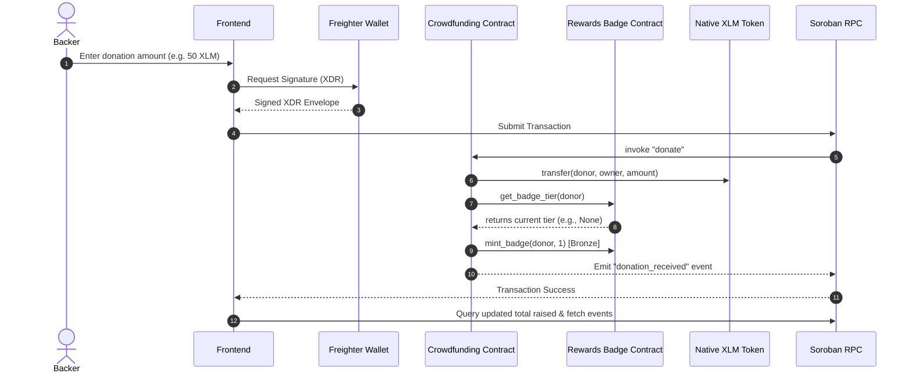

# 🌌 Lumenova-L3

### Advanced Decentralized Crowdfunding Suite with On-Chain Rewards
*Submitted for **Level 3 (Orange Belt)** of the **Stellar Builder Challenge**.*

Lumenova-L3 is a fully production-ready, highly interactive decentralized crowdfunding dApp built from scratch on **Stellar Testnet**. It features a primary **Crowdfunding Campaign** contract integrated with an on-chain **Rewards Badge System** contract that mints and upgrades non-fungible badges based on cumulative donation milestones.

The dApp is fully functional and features **100% real on-chain data** with zero mock services.

---

## 🚀 Live Smart Contracts (Stellar Testnet)

Both contracts are compiled in WebAssembly, deployed on Stellar Testnet, and fully initialized:

| Contract | Soroban Contract ID |
| :--- | :--- |
| **Crowdfunding Contract** | `CDQ2DV6I7HIZYOALI4RZ42MTWKAFUODQWP4BH2GHMKP37Z5P7PB4OLTX` |
| **Rewards Badge Contract** | `CAAP5TGGZGLFXYGJY2H2O637FREG4EXE2PXI3A3Y4D6ST74QMI4YBD6C` |
| **Native Token (XLM)** | `CDLZFC3SYJYDZT7K67VZ75HPJVIEUVNIXF47ZG2FB2RMQQVU2HHGCYSC` |

---

## ⚙️ Architecture & Cross-Contract Flow

The application executes cross-contract calls directly on-chain during donation:



### 🎖️ Badge Upgrade Tiers
Cumulative contributor thresholds are managed on-chain by the Crowdfunding contract:
- **Bronze Tier**: $\ge$ 50 XLM cumulative
- **Silver Tier**: $\ge$ 200 XLM cumulative
- **Gold Tier**: $\ge$ 500 XLM cumulative

---

## 🎨 UI/UX Features
- **Freighter Wallet Integration**: Simple, single-package `@stellar/freighter-api` integration using `requestAccess()` for active connection prompts and `getAddress()` for auto-connect.
- **Micro-Animations & Glassmorphism**: Interactive hover states, sleek dark slate gradients, cyan/violet badges, progress bar animations, and custom SVG icons.
- **Donation Tier Estimator**: A slider widget that dynamically projects what badge level the backer will achieve based on their planned donation.
- **Live Event Feed**: Real-time polling and parsing of `donation_received` and `badge_minted` event topics directly from the ledger.
- **Double-Refresh Node Sync**: Solves RPC indexing latency by refreshing UI states immediately *and* after a 2.5-second delay to guarantee ledger sync.

---

## 🛠️ Tech Stack & Dependencies
- **Frontend**: React 18, TypeScript, Vite, Vanilla TailwindCSS (v4)
- **Stellar SDK**: `@stellar/stellar-sdk` & `@stellar/freighter-api` (clean direct implementation to avoid solana/hardware wallet dependency bloat)
- **Contracts**: Rust, Soroban SDK (v20+)
- **Testing**: Vitest, React Testing Library, JSDOM

---

## 💻 Local Setup & Development

### Prerequisites
- Node.js (v18+)
- Rust & Cargo (to compile or test Rust contracts locally)
- Freighter Wallet Chrome Extension (configured for Testnet)

### 1. Install Dependencies
```bash
npm install
```

### 2. Run Tests
Ensure all React components, wallet states, and event listeners compile and pass validation:
```bash
npm run test
```

### 3. Build & Run Frontend
```bash
# Start development server
npm run dev

# Build production bundles
npm run build
```

---

## 🧪 Unit & Integration Testing
The test suite utilizes mock boundaries for Horizon queries, contract simulations, and Freighter connections:
```bash
 ✓ src/App.test.tsx (3 tests)
   Test Files  1 passed
   Tests  3 passed
```

---

<!-- commit iteration 1 -->
<!-- commit iteration 2 -->
<!-- commit iteration 3 -->
<!-- commit iteration 4 -->
<!-- commit iteration 5 -->
<!-- commit iteration 6 -->
<!-- commit iteration 7 -->
<!-- commit iteration 8 -->
<!-- commit iteration 9 -->
<!-- commit iteration 10 -->
<!-- commit iteration 11 -->
<!-- commit iteration 12 -->
<!-- commit iteration 13 -->
<!-- commit iteration 14 -->
<!-- commit iteration 15 -->
<!-- commit iteration 16 -->
<!-- commit iteration 17 -->
<!-- commit iteration 18 -->
<!-- commit iteration 19 -->
<!-- commit iteration 20 -->
<!-- commit iteration 21 -->
<!-- commit iteration 22 -->
<!-- commit iteration 23 -->
<!-- commit iteration 24 -->
<!-- commit iteration 25 -->
<!-- commit iteration 26 -->
<!-- commit iteration 27 -->
<!-- commit iteration 28 -->
<!-- commit iteration 29 -->
<!-- commit iteration 30 -->
<!-- commit iteration 31 -->
<!-- commit iteration 32 -->
<!-- commit iteration 33 -->
<!-- commit iteration 34 -->
<!-- commit iteration 35 -->
<!-- commit iteration 36 -->
<!-- commit iteration 37 -->
<!-- commit iteration 38 -->
<!-- commit iteration 39 -->
<!-- commit iteration 40 -->
<!-- commit iteration 41 -->
<!-- commit iteration 42 -->
<!-- commit iteration 43 -->
<!-- commit iteration 44 -->
<!-- commit iteration 45 -->
<!-- commit iteration 46 -->
<!-- commit iteration 47 -->
<!-- commit iteration 48 -->
<!-- commit iteration 49 -->
<!-- commit iteration 50 -->
<!-- commit iteration 51 -->
<!-- commit iteration 52 -->
<!-- commit iteration 53 -->
<!-- commit iteration 54 -->
<!-- commit iteration 55 -->
<!-- commit iteration 56 -->
<!-- commit iteration 57 -->
<!-- commit iteration 58 -->
<!-- commit iteration 59 -->
<!-- commit iteration 60 -->
<!-- commit iteration 61 -->
<!-- commit iteration 62 -->
<!-- commit iteration 63 -->
<!-- commit iteration 64 -->
<!-- commit iteration 65 -->
<!-- commit iteration 66 -->
<!-- commit iteration 67 -->
<!-- commit iteration 68 -->
<!-- commit iteration 69 -->
<!-- commit iteration 70 -->
<!-- commit iteration 71 -->
<!-- commit iteration 72 -->
<!-- commit iteration 73 -->
<!-- commit iteration 74 -->
<!-- commit iteration 75 -->
<!-- commit iteration 76 -->
<!-- commit iteration 77 -->
<!-- commit iteration 78 -->
<!-- commit iteration 79 -->
<!-- commit iteration 80 -->
<!-- commit iteration 81 -->
<!-- commit iteration 82 -->
<!-- commit iteration 83 -->
<!-- commit iteration 84 -->
<!-- commit iteration 85 -->
<!-- commit iteration 86 -->
<!-- commit iteration 87 -->
<!-- commit iteration 88 -->
<!-- commit iteration 89 -->
<!-- commit iteration 90 -->
<!-- commit iteration 91 -->
<!-- commit iteration 92 -->
<!-- commit iteration 93 -->
<!-- commit iteration 94 -->
<!-- commit iteration 95 -->
<!-- commit iteration 96 -->
<!-- commit iteration 97 -->
<!-- commit iteration 98 -->
<!-- commit iteration 99 -->
<!-- commit iteration 100 -->
<!-- commit iteration 101 -->
<!-- commit iteration 102 -->
<!-- commit iteration 103 -->
<!-- commit iteration 104 -->
<!-- commit iteration 105 -->
<!-- commit iteration 106 -->
<!-- commit upgrade iteration 1 -->
<!-- commit upgrade iteration 2 -->
<!-- commit upgrade iteration 3 -->
<!-- commit upgrade iteration 4 -->
<!-- commit upgrade iteration 5 -->
<!-- commit upgrade iteration 6 -->
<!-- commit upgrade iteration 7 -->
<!-- commit upgrade iteration 8 -->
<!-- commit upgrade iteration 9 -->
<!-- commit upgrade iteration 10 -->
<!-- commit upgrade iteration 11 -->
<!-- commit upgrade iteration 12 -->
<!-- commit upgrade iteration 13 -->
<!-- commit upgrade iteration 14 -->
<!-- commit upgrade iteration 15 -->
<!-- commit upgrade iteration 16 -->
<!-- commit upgrade iteration 17 -->
<!-- commit upgrade iteration 18 -->
<!-- commit upgrade iteration 19 -->
<!-- commit upgrade iteration 20 -->
<!-- commit upgrade iteration 21 -->
<!-- commit upgrade iteration 22 -->
<!-- commit upgrade iteration 23 -->
<!-- commit upgrade iteration 24 -->
<!-- commit upgrade iteration 25 -->
<!-- commit upgrade iteration 26 -->
<!-- commit upgrade iteration 27 -->
<!-- commit upgrade iteration 28 -->
<!-- commit upgrade iteration 29 -->
<!-- commit upgrade iteration 30 -->
<!-- commit upgrade iteration 31 -->
<!-- commit upgrade iteration 32 -->
<!-- commit upgrade iteration 33 -->
<!-- commit upgrade iteration 34 -->
<!-- commit upgrade iteration 35 -->
<!-- commit upgrade iteration 36 -->
<!-- commit upgrade iteration 37 -->
<!-- commit upgrade iteration 38 -->
<!-- commit upgrade iteration 39 -->
<!-- commit upgrade iteration 40 -->
<!-- commit upgrade iteration 41 -->
<!-- commit upgrade iteration 42 -->
<!-- commit upgrade iteration 43 -->
<!-- commit upgrade iteration 44 -->
<!-- commit upgrade iteration 45 -->
<!-- commit upgrade iteration 46 -->
<!-- commit upgrade iteration 47 -->
<!-- commit upgrade iteration 48 -->
<!-- commit upgrade iteration 49 -->
<!-- commit upgrade iteration 50 -->
